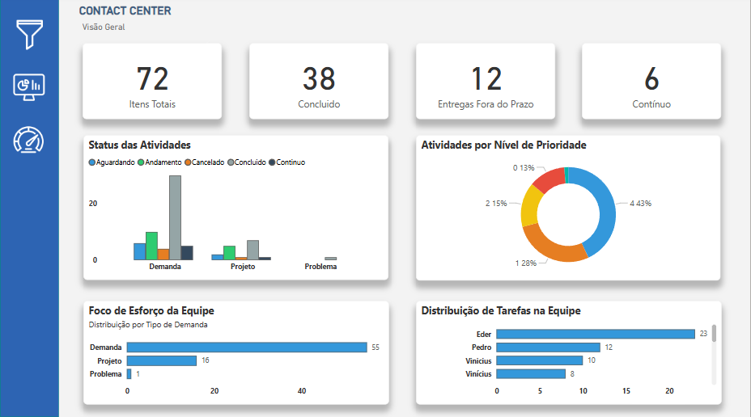
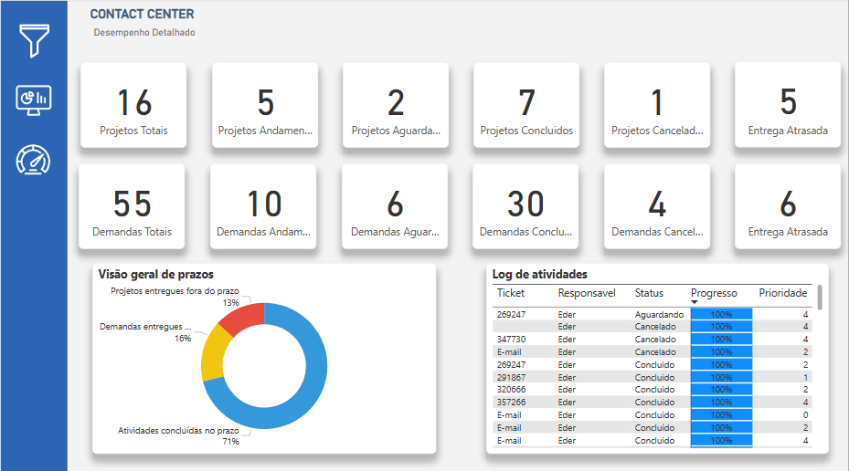
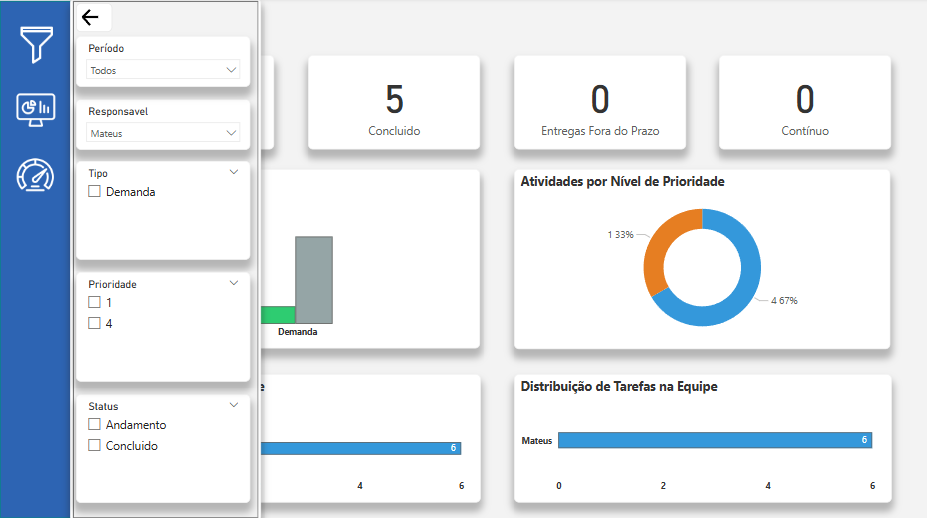

# Dashboard-Contact-Center
Dashboard de análise de performance para Contact Center desenvolvido com Power BI.
# Dashboard de Performance para Contact Center | Power BI


<p align="center">
  
</p>

## 📄 Resumo do Projeto

Este projeto consiste em um dashboard de Business Intelligence desenvolvido em Power BI para o monitoramento e análise de performance de um Contact Center. A ferramenta centraliza os principais indicadores (KPIs) de projetos, demandas e atividades da equipe, oferecendo uma visão estratégica e detalhada para gestores e líderes de equipe. O objetivo é transformar dados brutos de atendimento e tarefas em insights visuais e acionáveis, facilitando a tomada de decisão, a identificação de gargalos e a otimização da distribuição de trabalho.

## 📌 Tecnologias Utilizadas

* **Power BI:** Ferramenta principal para modelagem de dados, criação de visuais e publicação do dashboard.
* **DAX (Data Analysis Expressions):** Utilizado para a criação de métricas e colunas calculadas complexas, como o controle de status e análise de prazos.
* **Power Query (Editor M):** Para extração, tratamento e limpeza dos dados (ETL) a partir das fontes originais (ex: planilhas Excel, listas do SharePoint ou banco de dados SQL).

## 🎯 O Problema Resolvido

A gestão do Contact Center enfrentava desafios devido à descentralização das informações e à dificuldade em acompanhar o progresso das atividades em tempo real. Este dashboard foi criado para solucionar problemas como:

* Falta de visibilidade sobre a carga de trabalho e distribuição de tarefas na equipe.
* Dificuldade em monitorar o cumprimento de prazos (SLAs).
* Processo manual e demorado para gerar relatórios de performance.
* Falta de insights claros sobre os tipos de demandas e projetos mais recorrentes.

## 📊 Dashboards e Resultados

O painel é dividido em duas visões principais para uma análise completa:

#### Visão Geral
Oferece um resumo executivo dos principais KPIs, ideal para uma análise rápida do status da operação.

<p align="center">
  
</p>

#### Desempenho Detalhado
Permite uma análise mais profunda do andamento dos projetos e demandas, incluindo um log de atividades e visão de prazos.

<p align="center">
  
</p>

#### Interatividade e Filtros
O dashboard é totalmente interativo, permitindo filtros por período, responsável e status da atividade, proporcionando análises personalizadas.

<p align="center">
  
</p>

**Principais KPIs e Métricas Monitoradas:**
* Projetos e Demandas (Total, Em Andamento, Concluído, Atrasado).
* Visão Geral de Prazos (Percentual de atividades dentro e fora do prazo).
* Status das Atividades (Aguardando, Andamento, Cancelado, etc.).
* Distribuição de Tarefas por Membro da Equipe.
* Foco de Esforço da Equipe (Demandas vs. Projetos vs. Problemas).

## 🚀 Como Utilizar

1.  **Pré-requisitos:** É necessário ter o **Power BI Desktop** instalado.
2.  **Clone o repositório:**
    ```bash
    git clone [https://github.com/seu-usuario/powerbi-contact-center-dashboard.git](https://github.com/seu-usuario/powerbi-contact-center-dashboard.git)
    ```
3.  **Abra o arquivo:** Navegue até a pasta do projeto e abra o arquivo `ContactCenterDashboard.pbix` (ou o nome do seu arquivo) no Power BI Desktop.
4.  **Conecte suas fontes de dados:** Se necessário, atualize as credenciais e o caminho das fontes de dados no Power Query para refletir o seu ambiente local.

## 📁 Estrutura do Repositório
```
/
├── ContactCenterDashboard.pbix   # Arquivo principal do Power BI
├── README.md                     # Documentação do projeto
└── img/                          # Pasta com os screenshots do dashboard
    ├── image_6906d5.png
    ├── image_690731.png
    └── image_6906f2.png
```

## 📝 Licença

Este projeto está sob a licença MIT. Veja o arquivo `LICENSE` para mais detalhes.
